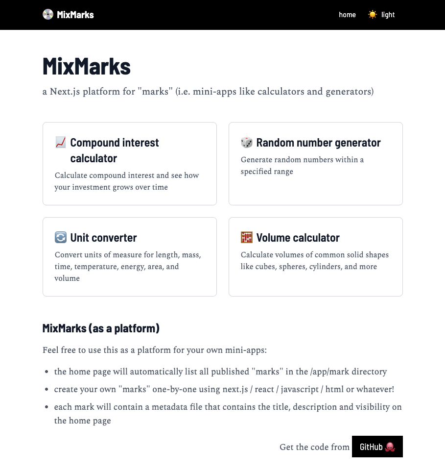
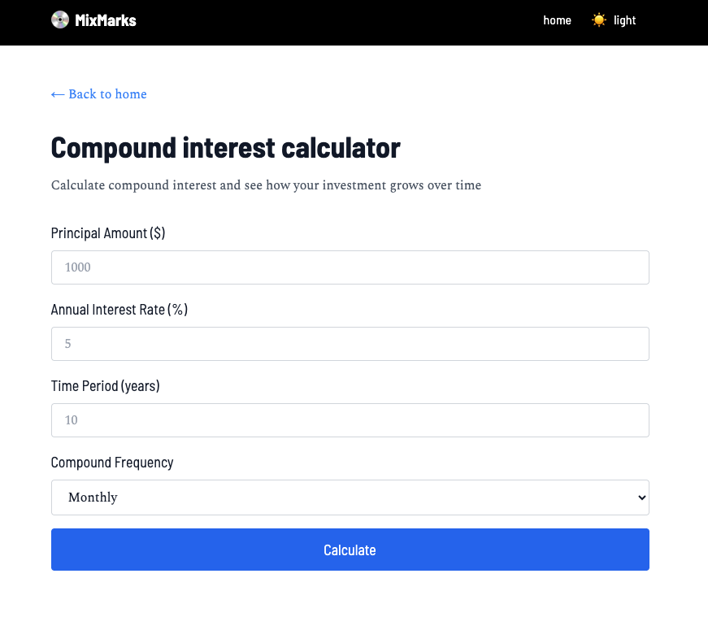

# mixmarks

a Next.js platform for "marks" (i.e. mini-apps like calculators and generators)



The focus of this project is not on the "marks" themselves but their container as a _portfolio_ (the classic "list and item" solution!)

It's also a great repo to learn about the inner workings of Next.js for those learning it!

## Features

* fixed header
* simple folder structure: `/mark`
  * each "mark" has its own: 
    * subfolder: 
      * a `page.tsx` file
      * a `metadata.ts` file 
* light / dark / system themes
* 4 sample marks for inspiration

Sample of a "mark":



## Specifications

* front-end frameworks: `next.js` and `tailwind`
* no back-end: just pure front-end

## Demo

Run the demo on [mixmarks.joncoded.com](https://mixmarks.joncoded.com) or [mixmarks-joncoded.vercel.app](https://mixmarks.vercel.app) in case the former doesn't work

## Setup (for developers)

### clone repo

Run the following command on your command line:

```bash
% git clone https://github.com/joncoded/mixmarks.git mixmarks && cd mixmarks
% npm install
% npm run dev
```

The app will run on `http://localhost:3000`

(if port 3000 is already used, it will host the app on `:3001` or on the next available port)

## Contribute

Make changes by following this procedure:

* clone the repository as mentioned above
* create a feature branch
  * `git checkout -b feature/branch`
* make and commit your changes
  * `git commit -m "what you changed"`
* push your changes
  * `git push origin feature/branch`
* open pull request
  * https://github.com/joncoded/mixmarks/pulls

Also, feel free to [raise any issues](https://github.com/joncoded/mixmarks/issues)!

## Credits

* [Claude (Sonnet)](https://claude.ai) for helping me create the basis for this in one morning (it's the idea behind the "container" project, not the code itself, that I was trying to bring to life!)


